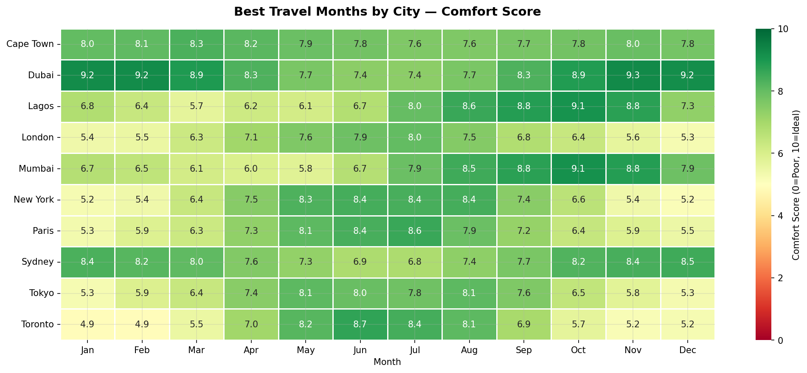

# Weather Data Analysis

## Overview
Analysis of 5 years of daily weather data across 10 global cities
(2019–2023). Uncovers seasonal temperature patterns, rainfall 
distribution, climate comparisons, and travel comfort scores — 
framed from an urban planning, travel, and climate risk perspective.

## Key Results
- Total observations: 18,260 daily records across 10 cities
- Hottest city: Dubai (28°C avg, 43.5°C peak)
- Coldest city: Toronto (8°C avg, -14.8°C min)
- Widest temp range: Toronto (41.1°C swing)
- Wettest city: Lagos (14,370mm over 5 years)
- Driest city: Dubai (1,398mm over 5 years)
- Clear days globally: 52.9% of all observations
- Best travel cities: Cape Town & Sydney

## Visualizations

| Chart | Description |
|-------|-------------|
| Chart 1 | Average temperature by city |
| Chart 2 | Monthly temperature trends for 6 cities |
| Chart 3 | Total rainfall by city 2019–2023 |
| Chart 4 | Temperature vs humidity scatter |
| Chart 5 | Seasonal temperature box plots |
| Chart 6 | Weather conditions — global and by city |
| Chart 7 | Monthly rainfall heatmap |
| Chart 8 | Travel comfort score heatmap |

## Key Insights
- Dubai peaks at 43.5°C — extreme heat infrastructure is critical year-round
- Toronto swings 41.1°C — highest seasonal energy demand of any city analysed
- Lagos receives 14,370mm of rain — tropical cities need dedicated flood infrastructure
- Cape Town and Sydney score best on comfort year-round — highest livability
- Tokyo best visited in May/October — New York best in May-June and September

## Tools Used
Python | pandas | numpy | matplotlib | seaborn | Jupyter Notebook

## Files
- `weather_data_analysis.ipynb` — Full analysis notebook
- `README_Project.docx` — Detailed project write-up
